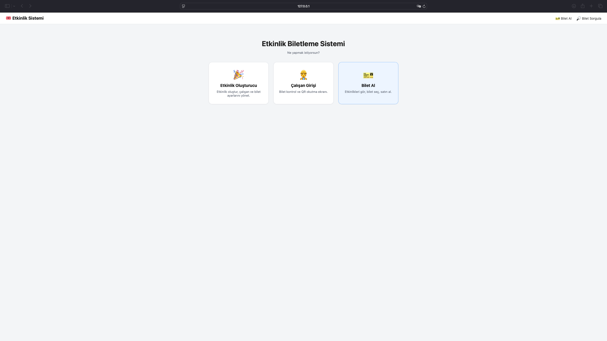
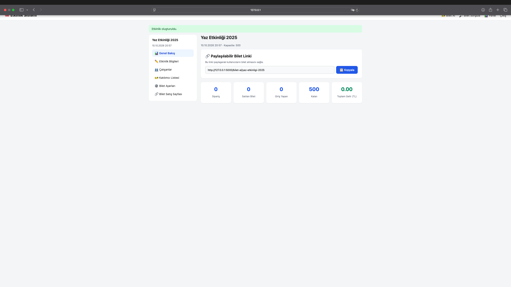
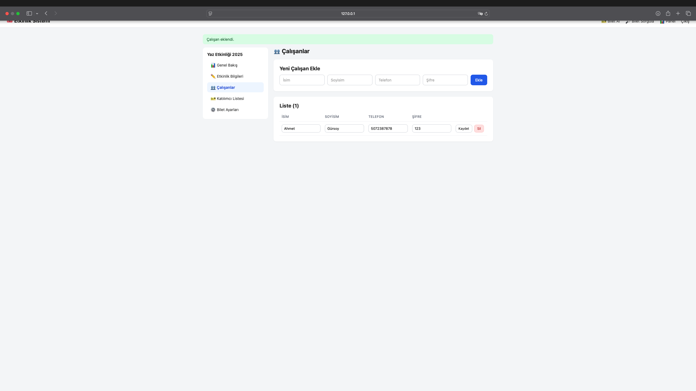
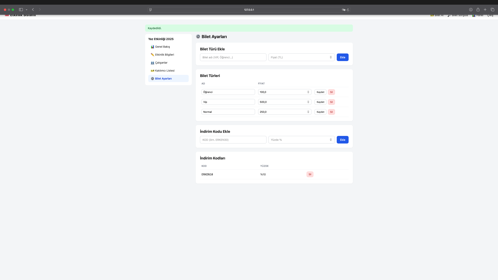
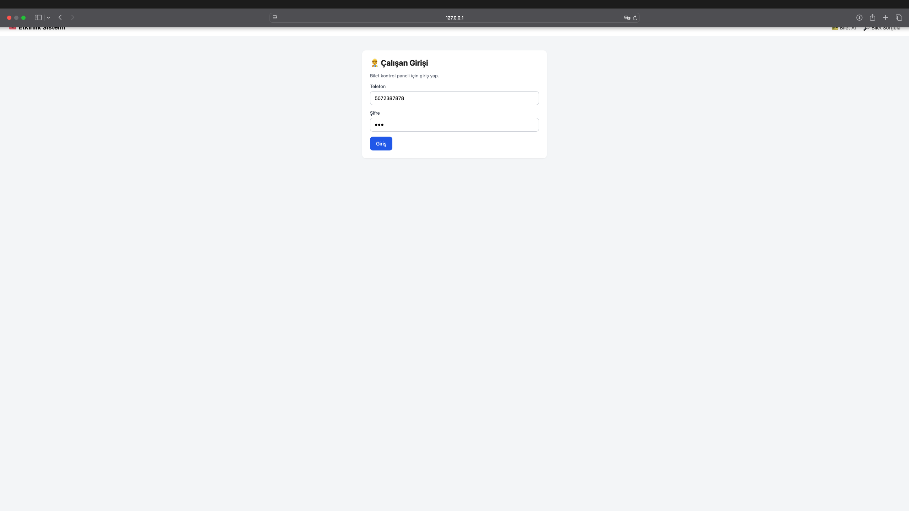
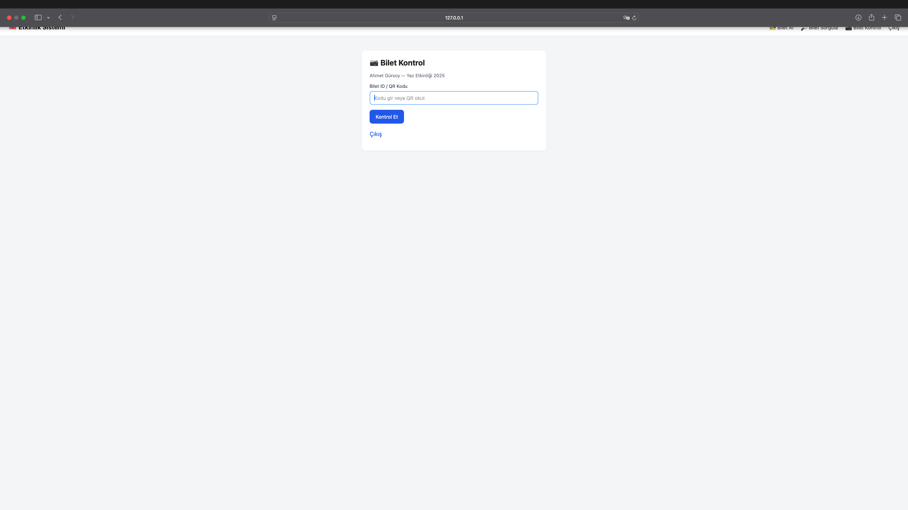
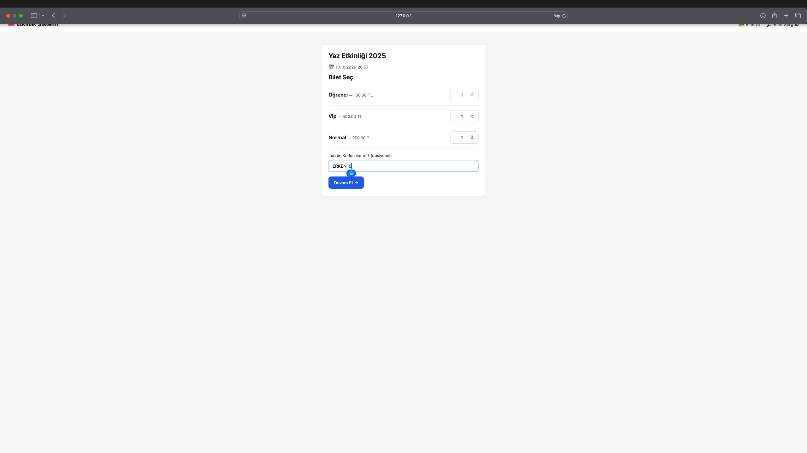
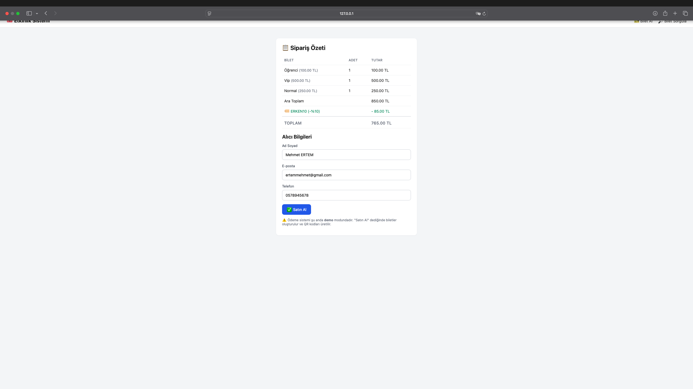
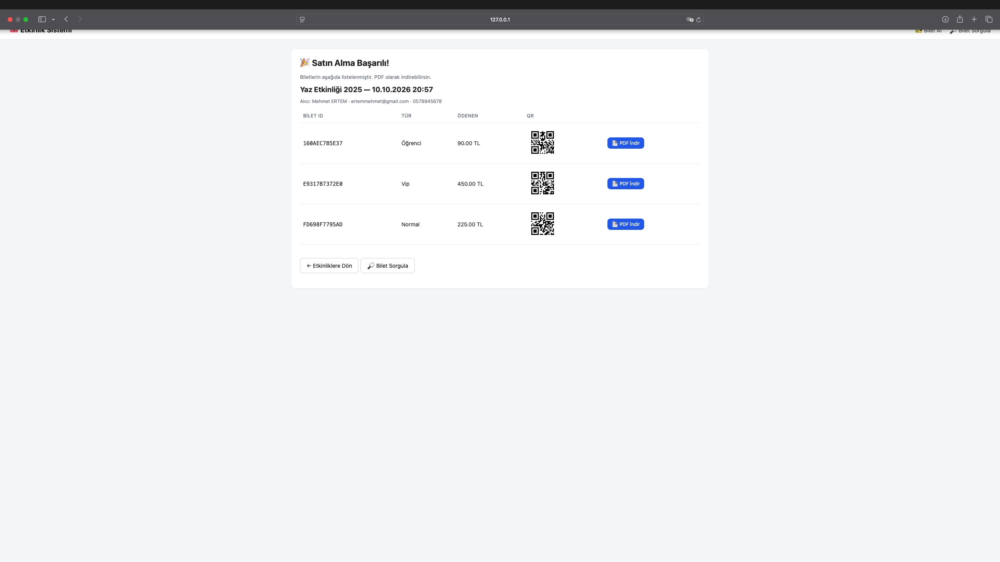
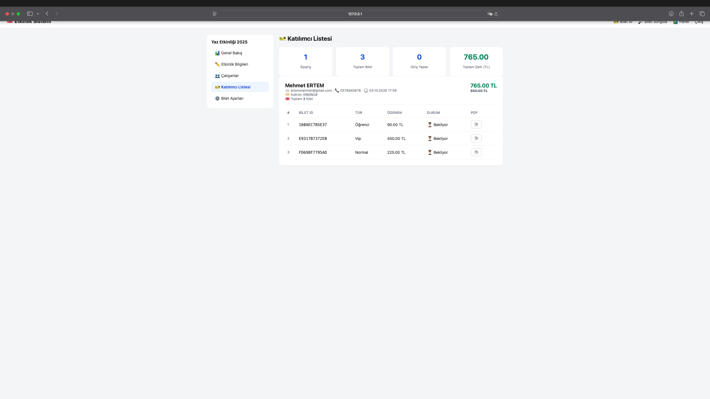

<div align="center">

# 🎟️ TicketFlow

### Modern, açık kaynaklı etkinlik biletleme ve katılımcı yönetim sistemi

**Etkinlik, konser, festival, konferans, workshop ve her türlü organizasyon için**  
**tek kurulumda etkinlik oluşturma, bilet satışı, QR kod üretimi, PDF bilet ve giriş kontrolü.**

[](https://www.gnu.org/licenses/agpl-3.0)
[](https://www.python.org/)
[](https://flask.palletsprojects.com/)
[](https://www.sqlite.org/)
[](http://makeapullrequest.com)
[](https://github.com/mdaedalus/ticketflow)

[Özellikler](#-özellikler) · [Ekran Görüntüleri](#-ekran-görüntüleri) · [Kurulum](#-kurulum) · [Kullanım](#-kullanım-akışı) · [API](#-api-referansı) · [Katkı](#-katkıda-bulunma) · [Lisans](#-lisans)

</div>

---

## 🎯 Nedir Bu?

**TicketFlow**, etkinlik organizatörlerinin kağıt bilete ve dağınık Excel tablolarına veda etmesini sağlayan, modern ve minimalist bir **bilet satış + katılımcı yönetim + giriş kontrol** sistemidir. Kurulum sonrası **5 dakikada** etkinliğini oluşturur, bilet türlerini ve indirim kodlarını tanımlar, çalışanlarını eklersin ve bilet satmaya başlarsın.

Müşteri etkinlik linkini açar → bilet türünü seçer → bilgilerini girer → satın alır.  
Sistem her bilet için **benzersiz QR kod + PDF** üretir.  
Çalışan kapıda QR okutur → giriş onaylanır → katılımcı içeri girer.  
Organizatör panelden canlı olarak **kaç bilet satıldı, kim geldi, ne kadar ciro yapıldı** görür.

### 💡 Neden TicketFlow?

- 🚀 **Sıfır kurulum karmaşası** — SQLite ile dosya tabanlı, harici sunucu gerektirmez
- 📱 **Mobil uyumlu** — müşteri tarafı telefonda kusursuz çalışır
- 🎫 **Çoklu bilet türü** — VIP, öğrenci, erken kuş, davetli... sınırsız tanımlama
- 🏷️ **İndirim kodları** — yüzdelik indirim uygula (örn. `ERKEN30` → %30)
- 🔳 **Otomatik QR + PDF** — her bilet için özel QR kod ve yazdırılabilir PDF
- 📊 **Canlı panel** — sipariş, ciro, giriş yapan katılımcı sayısı anlık
- 👨‍💼 **Çalışan yönetimi** — kapıda QR okutacak görevlileri sisteme ekle
- 🔎 **3 yollu bilet sorgulama** — telefon, e-posta veya bilet ID ile
- 📷 **QR ile giriş kontrolü** — sadece yetkili çalışanlar giriş onaylayabilir
- 📧 **E-posta modülü hazır** — opsiyonel olarak aktif edilebilir (SMTP)
- 💳 **Ödeme altyapısı hazır** — `process_payment()` fonksiyonu ileri entegrasyona hazır
- 🔓 **Açık kaynak** — AGPL-3.0, kendi sunucunuzda barındırın
- 🇹🇷 **Türkçe öncelikli** — yerel organizatörler için tasarlandı
- 🔌 **API-first** — mobil uygulama geliştirmeye hazır mimari

---

## ✨ Özellikler

### 🎉 Etkinlik Yönetimi
- ✅ Basit e-posta ile yönetici girişi (kayıt yok, otomatik oturum)
- ✅ Etkinlik oluşturma (isim, **takvimden tarih + saat**, kapasite)
- ✅ Etkinlik bilgilerini düzenleme
- ✅ Her etkinliğe özel **paylaşılabilir satış linki** (slug bazlı)
- ✅ Yayında / yayında değil kontrolü

### 🎫 Bilet Türü ve Fiyatlandırma
- ✅ Sınırsız bilet türü (VIP, Öğrenci, Erken Kuş, Davetli...)
- ✅ Her türe ayrı fiyat
- ✅ Bilet türü ekle / düzenle / sil
- ✅ Yüzdelik **indirim kodları** (örn. `YAZ2025` → %20)
- ✅ İndirim kodu ekle / sil

### 👨‍💼 Çalışan Yönetimi
- ✅ Çalışan ekle / sil / düzenle
- ✅ İsim, soyisim, telefon, şifre
- ✅ Her çalışana ayrı giriş (bilet kontrol paneli)
- ✅ Kapıda **QR okutma** ve giriş onaylama
- ✅ "Bu bilet zaten kullanılmış" uyarısı

### 🛒 Bilet Satışı (Herkese Açık)
- ✅ Etkinlik listesi (`/bilet-al`)
- ✅ Etkinlik detayı — bilet türleri + adet seçimi
- ✅ İndirim kodu uygulama
- ✅ Sipariş özeti (ara toplam, indirim, toplam)
- ✅ Alıcı bilgileri (ad soyad, e-posta, telefon)
- ✅ **Ödeme modülü pasif** — demo modunda anında satın alma

### 🔳 QR & PDF
- ✅ Her bilet için **benzersiz bilet ID** (örn. `A1B2C3D4E5F6`)
- ✅ Otomatik **QR kod** üretimi
- ✅ Her bilet için **A4 PDF bilet** (QR + tüm bilgiler)
- ✅ Tek tıkla PDF indirme

### 🔎 Bilet Sorgulama
- ✅ **3 sekmeli sorgu**: Telefon / E-posta / Bilet ID
- ✅ Toplam ödenen tutar gösterimi
- ✅ Bilet durumu (giriş yapıldı / bekliyor)
- ✅ PDF tekrar indirme

### 📊 Yönetici Paneli
- ✅ Genel bakış — sipariş, bilet, giriş, kalan, **toplam ciro**
- ✅ Katılımcı listesi — her biletin detayı ve toplam tutar
- ✅ Çalışan yönetimi
- ✅ Bilet ayarları (tür + indirim kodu)
- ✅ Paylaşılabilir satış linki kopyalama

### 📷 Bilet Kontrol (Sadece Çalışanlar)
- ✅ Telefon + şifre ile giriş
- ✅ QR kod / bilet ID ile anlık kontrol
- ✅ Çift kullanım engeli
- ✅ Giriş saat kaydı

### 🎨 Tasarım
- ✅ Modern minimalist arayüz
- ✅ Yumuşak gri + mavi palet
- ✅ Responsive (mobil/tablet/masaüstü)
- ✅ Sidebar tabanlı yönetici paneli
- ✅ Sekmeli sorgu arayüzü

---

## 🖼️ Ekran Görüntüleri













---

## 🛠️ Teknoloji Yığını

| Katman | Teknoloji |
|--------|-----------|
| **Backend** | Python 3.10+, Flask 3.0 |
| **Veritabanı** | SQLite (dosya tabanlı), SQLAlchemy ORM |
| **Frontend** | Vanilla JS, HTML5, CSS3 |
| **QR Üretimi** | `qrcode[pil]` |
| **PDF Üretimi** | `reportlab` |
| **Şablon** | Jinja2 |
| **Font** | Inter / sistem fontları |

---

## 🚀 Kurulum

### Gereksinimler
- Python 3.10 veya üzeri
- pip

### Adım Adım

```bash
# 1. Repoyu klonla
git clone https://github.com/mdaedalus/ticketflow.git
cd ticketflow

# 2. Sanal ortam oluştur
python -m venv venv

# Windows:
venv\Scripts\activate

# macOS/Linux:
source venv/bin/activate

# 3. Bağımlılıkları yükle
pip install -r requirements.txt

# 4. Uygulamayı başlat
python app.py
```

Tarayıcınızda açın: **http://localhost:5000**

---

## 🗺️ Kullanım Akışı

Sistem üç farklı kullanıcı rolüne sahiptir:

### 1️⃣ Organizatör (Yönetici)

| Adres | Yaptığı İş |
|-------|------------|
| `http://localhost:5000/` | Ana sayfa (rol seçimi) |
| `http://localhost:5000/olusturucu/giris` | Yönetici girişi |
| `http://localhost:5000/etkinlik/olustur` | Etkinlik oluşturma (takvim) |
| `http://localhost:5000/panel` | Genel bakış (ciro, sipariş, katılımcı) |
| `http://localhost:5000/etkinlik/duzenle` | Etkinlik bilgileri |
| `http://localhost:5000/calisanlar` | Çalışan yönetimi |
| `http://localhost:5000/katilimcilar` | Katılımcı listesi + ciro |
| `http://localhost:5000/bilet-ayarlari` | Bilet türleri + indirim kodları |

### 2️⃣ Çalışan (Bilet Kontrol)

| Adres | Yaptığı İş |
|-------|------------|
| `http://localhost:5000/calisan/giris` | Telefon + şifre ile giriş |
| `http://localhost:5000/calisan/tara` | QR / bilet ID ile giriş kontrolü |

### 3️⃣ Müşteri (Bilet Alan)

| Adres | Yaptığı İş |
|-------|------------|
| `http://localhost:5000/bilet-al` | Etkinlik listesi |
| `http://localhost:5000/bilet-al/<slug>` | Etkinlik detayı + bilet seçimi |
| `http://localhost:5000/bilet-al/<slug>/odeme` | Ödeme + alıcı bilgileri |
| `http://localhost:5000/siparis/<id>/basarili` | Biletler + QR + PDF |
| `http://localhost:5000/bilet-sorgula` | Telefon / e-posta / ID ile sorgu |

---

## 📁 Proje Yapısı

```
ticketflow/
├── app.py                       # Ana uygulama (Flask factory)
├── config.py                    # Yapılandırma
├── database.py                  # SQLAlchemy başlatma
├── models.py                    # Event, Employee, TicketType, DiscountCode, Order, Ticket
├── requirements.txt
├── LICENSE                      # AGPL-3.0
├── README.md
├── .gitignore
│
├── docs/                        # 📸 Ekran görüntüleri
│   └── screenshots/
│
├── routes/                      # Blueprint'ler
│   ├── __init__.py
│   ├── home.py                  # Ana sayfa (3 rol seçimi)
│   ├── admin.py                 # Yönetici girişi + panel
│   ├── employees.py             # Çalışan yönetimi
│   ├── tickets.py               # Bilet ayarları + katılımcılar
│   ├── purchase.py              # Bilet satış (herkese açık) + sorgulama
│   └── checkin.py               # Çalışan QR kontrol
│
├── utils/                       # Yardımcı fonksiyonlar
│   ├── __init__.py
│   ├── qr_generator.py          # QR kod üretimi
│   ├── pdf_generator.py         # Bilet PDF üretimi
│   └── mailer.py                # E-posta (opsiyonel - pasif)
│
├── templates/                   # Jinja2 şablonları
│   ├── base.html
│   ├── home.html
│   ├── admin_login.html
│   ├── create_event.html
│   ├── panel.html
│   ├── employees.html
│   ├── participants.html
│   ├── ticket_settings.html
│   ├── public_events.html
│   ├── public_event_detail.html
│   ├── public_checkout.html
│   ├── order_success.html
│   ├── ticket_query.html
│   ├── checkin_login.html
│   └── checkin.html
│
├── static/
│   ├── css/style.css
│   ├── js/main.js
│   ├── qr/                      # Oluşturulan QR kodlar
│   └── pdf/                     # Oluşturulan bilet PDF'leri
│
└── instance/
    └── etkinlik.db              # SQLite veritabanı (otomatik oluşur)
```

---

## 🔌 API Referansı

### Yönetici

| Metot | Endpoint | Açıklama |
|-------|----------|----------|
| `POST` | `/olusturucu/giris` | Yönetici girişi |
| `POST` | `/etkinlik/olustur` | Yeni etkinlik oluştur |
| `POST` | `/etkinlik/duzenle` | Etkinlik güncelle |
| `POST` | `/calisanlar` | Yeni çalışan ekle |
| `POST` | `/calisanlar/<id>/duzenle` | Çalışanı güncelle |
| `POST` | `/calisanlar/<id>/sil` | Çalışan sil |
| `POST` | `/bilet-ayarlari` | Bilet türü / indirim ekle |
| `POST` | `/bilet-turu/<id>/duzenle` | Bilet türü güncelle |
| `POST` | `/bilet-turu/<id>/sil` | Bilet türü sil |
| `POST` | `/indirim/<id>/sil` | İndirim sil |

### Çalışan

| Metot | Endpoint | Açıklama |
|-------|----------|----------|
| `POST` | `/calisan/giris` | Çalışan girişi |
| `POST` | `/calisan/tara` | Bilet ID / QR kontrol |

### Müşteri

| Metot | Endpoint | Açıklama |
|-------|----------|----------|
| `GET`  | `/bilet-al` | Etkinlik listesi |
| `GET`  | `/bilet-al/<slug>` | Etkinlik detayı |
| `POST` | `/bilet-al/<slug>/onayla` | Sepeti onayla |
| `POST` | `/bilet-al/<slug>/odeme` | Satın alma |
| `GET`  | `/siparis/<id>/basarili` | Biletler + QR + PDF |
| `GET`  | `/bilet/<ticket_code>/pdf` | Bilet PDF indir |
| `POST` | `/bilet-sorgula` | Telefon / e-posta / ID ile sorgu |

### Örnek İstek

```bash
curl -X POST http://localhost:5000/calisan/tara \
  -d "ticket_code=A1B2C3D4E5F6"
```

---

## 🔧 Özelleştirme

### E-posta Gönderimini Aktif Et

`config.py` içinde:

```python
MAIL_ENABLED = True
MAIL_SERVER = "smtp.gmail.com"
MAIL_PORT = 587
MAIL_USERNAME = "ornek@gmail.com"
MAIL_PASSWORD = "uygulama-sifresi"
MAIL_SENDER = "ornek@gmail.com"
```

> Sistem otomatik olarak satın alma sonrası alıcıya bilet e-postası gönderecektir.

### Ödeme Entegrasyonu

`routes/purchase.py` içindeki `process_payment()` fonksiyonunu doldur:

```python
def process_payment(order_data: dict) -> bool:
    # iyzico / stripe / paytr entegrasyonu buraya
    return True
```

---

## 🗺️ Yol Haritası

- [x] v0.1 — Yönetici girişi, etkinlik oluşturma, çalışan yönetimi
- [x] v0.2 — Bilet türleri, indirim kodları, PDF + QR üretimi
- [x] v0.3 — Herkese açık bilet satış sayfası, sipariş akışı
- [x] v0.4 — Çalışan bilet kontrol (QR okutma)
- [x] v0.5 — 3 yollu bilet sorgulama (telefon / e-posta / ID)
- [x] v0.6 — Ciro ve katılımcı istatistikleri
- [ ] v0.7 — Gerçek ödeme entegrasyonu (iyzico, Stripe)
- [ ] v0.8 — E-posta bildirimleri (SMTP aktif)
- [ ] v0.9 — Koltuk seçimi (numaralı oturma planı)
- [ ] v1.0 — Çoklu etkinlik yönetimi (tek hesap, birden fazla etkinlik)
- [ ] v1.1 — Kupon / davetiye sistemi
- [ ] v1.2 — iOS / Android mobil uygulama
- [ ] v1.3 — Docker + PostgreSQL
- [ ] v2.0 — Multi-tenant SaaS sürümü

---

## 🤝 Katkıda Bulunma

Katkılarınızı bekliyoruz! Büyük değişiklikler için önce bir **issue** açın.

```bash
# Fork → Clone → Branch → Commit → Push → PR
git checkout -b feature/yeni-ozellik
git commit -m "feat: yeni özellik eklendi"
git push origin feature/yeni-ozellik
```

### Commit Kuralları
- `feat:` yeni özellik
- `fix:` hata düzeltme
- `docs:` dokümantasyon
- `style:` kod formatı
- `refactor:` yeniden düzenleme
- `test:` test ekleme

---

## 💼 Ticari Kullanım & Lisanslama

Bu proje **AGPL-3.0** ile lisanslanmıştır.

### ✅ Yapabilirsiniz
- Ücretsiz kullanmak, değiştirmek, dağıtmak
- Ticari amaçla kullanmak (**açık kaynak şartıyla**)
- Kendi sunucunuzda barındırmak
- Etkinliğinizde kullanmak

### ⚠️ Şartlar
- Değiştirdiğiniz kodu **açık kaynak** olarak paylaşmalısınız
- Ağ üzerinden (SaaS) sunsanız bile kaynak kodu vermelisiniz

### 💰 Ticari Lisans (Kapalı Kaynak İsteyenler İçin)

Kodunuzu kapatmak veya SaaS olarak satmak istiyorsanız ticari lisans için iletişime geçin:

📧 **eminnesatg@gmail.com**

---

## 👨‍💻 Yazar

**Emin Neşat Gürses**

- 💼 LinkedIn: [Emin Neşat Gürses](https://www.linkedin.com/in/emin-ne%C5%9Fat-g%C3%BCrses-35723a284/)
- 📧 E-posta: [eminnesatg@gmail.com](mailto:eminnesatg@gmail.com)
- 🐙 GitHub: [@mdaedalus](https://github.com/mdaedalus)

---

## 📄 Lisans

Bu proje **GNU Affero General Public License v3.0** ile lisanslanmıştır.  
Detaylar için [LICENSE](LICENSE) dosyasına bakın.

---

<div align="center">

**⭐ Projeyi beğendiyseniz yıldız vermeyi unutmayın!**

[🐛 Bug Bildir](https://github.com/mdaedalus/ticketflow/issues) · [💡 Özellik Öner](https://github.com/mdaedalus/ticketflow/issues) · [📖 Wiki](https://github.com/mdaedalus/ticketflow/wiki)

</div>


